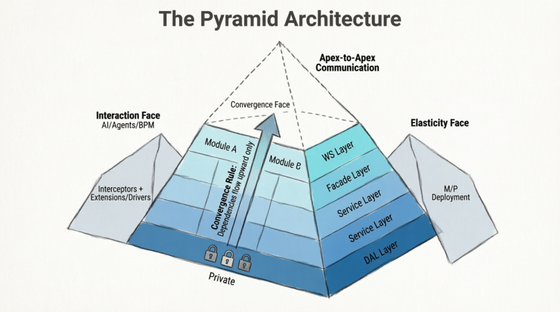
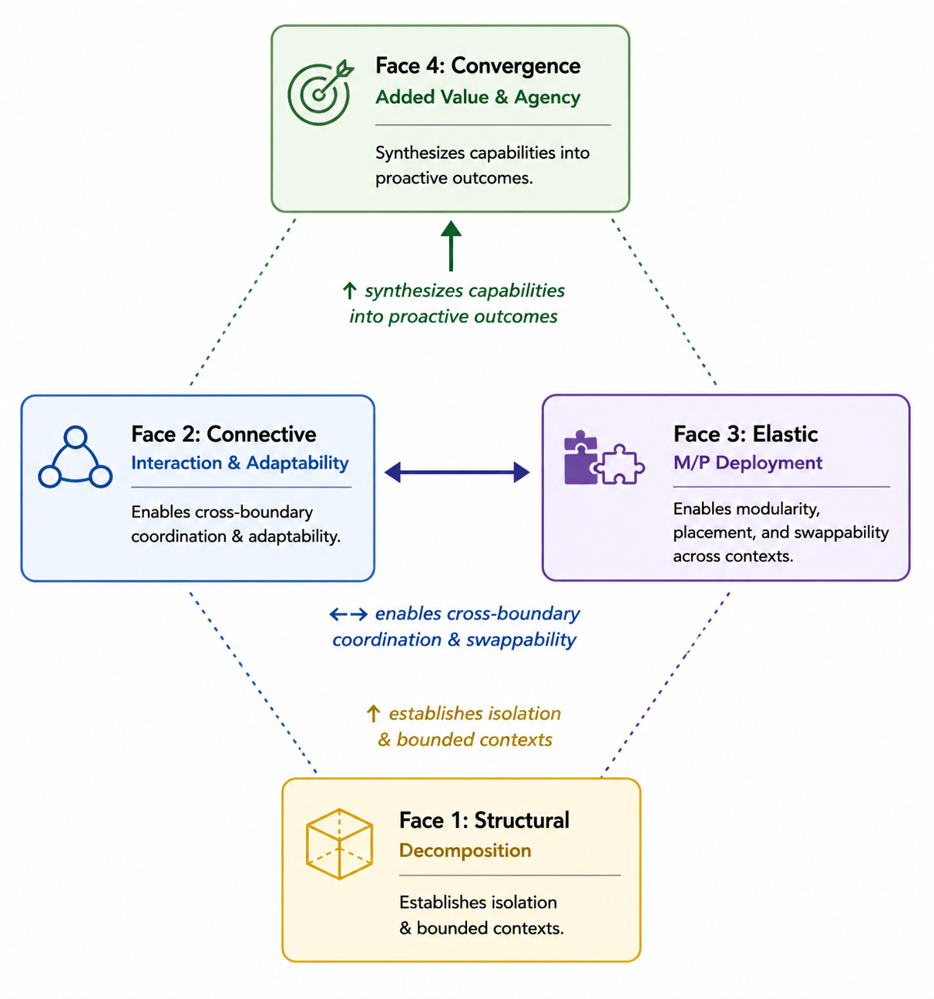
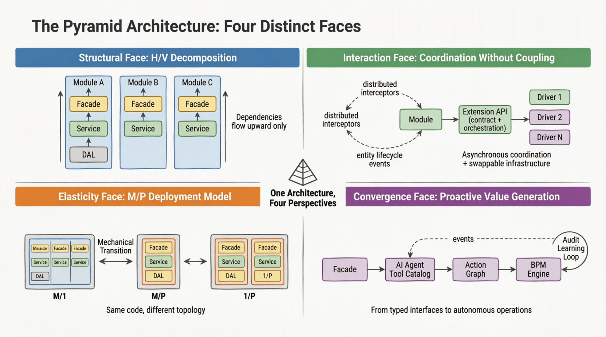
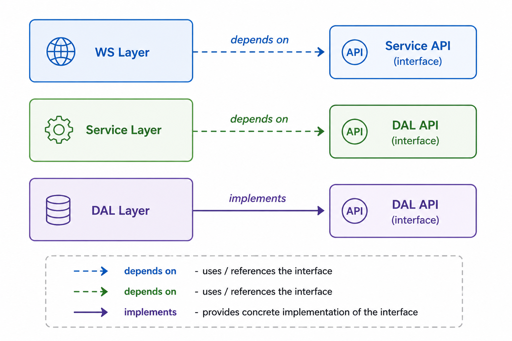
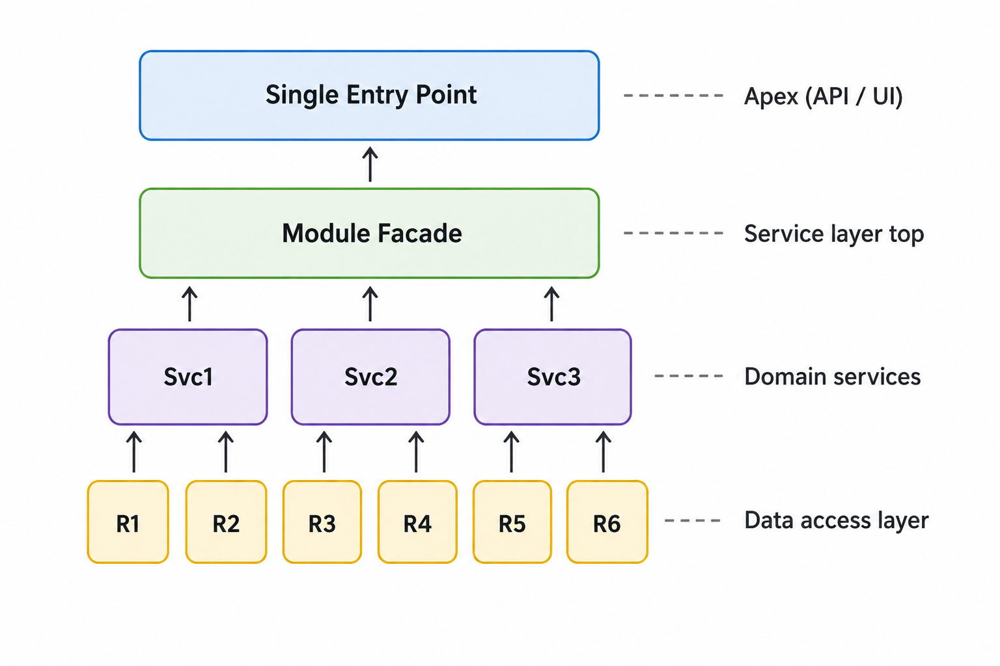
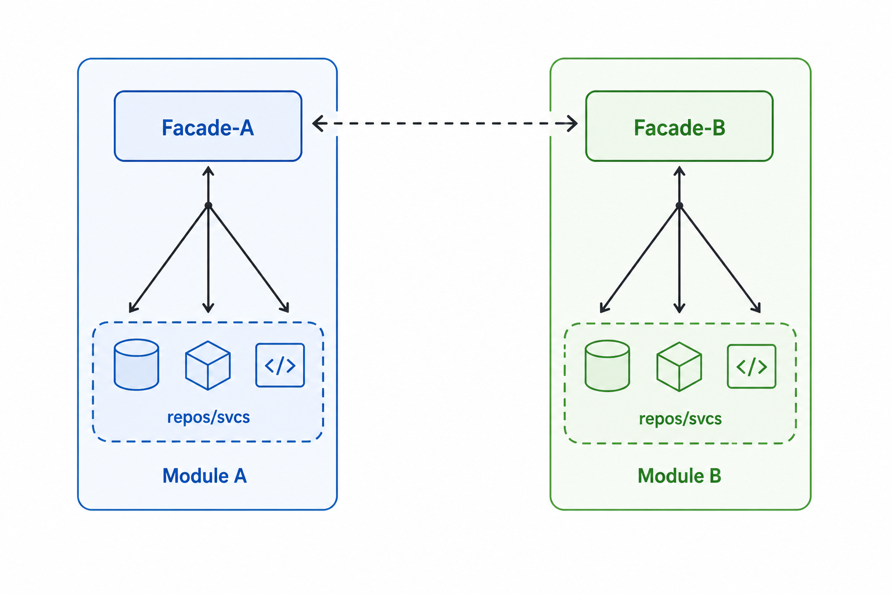
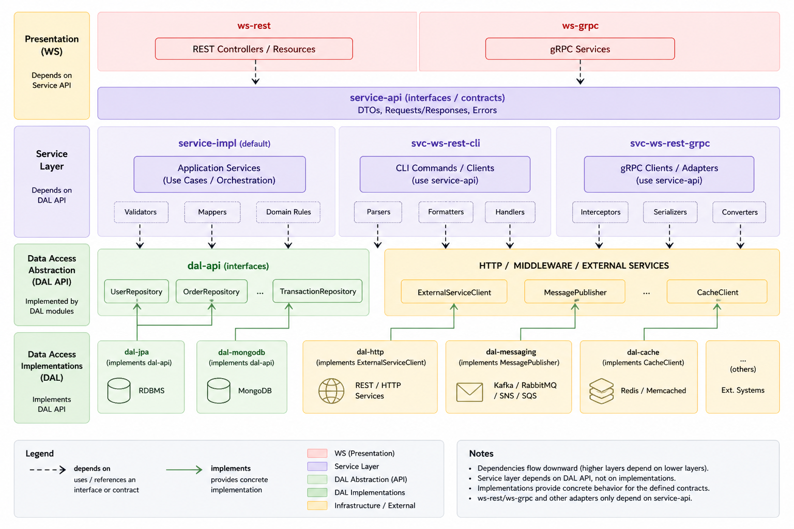

# The Pyramid Architecture
### A Modular, Agile and Scalable Software Architecture for Modern Products

---

## Executive Summary

**Problem:** Systems struggle to balance rapid iteration with long-term evolvability. Monoliths become rigid; microservices become operationally complex before they are needed.

**Solution:** The Pyramid Architecture enforces modular decomposition with strict layering and explicit communication rules, enabling:

- (yes) Independent module development, testing, and deployment
- (yes) Mechanical migration from modulith to microservices — and back
- (yes) Swappable infrastructure via a formal extension/driver model
- (yes) Built-in readiness for AI-agent integration
- (yes) A unified mental model expressed through four architectural faces

**Best suited for:** ERP platforms, multi-tenant SaaS, regulated environments requiring data sovereignty, and teams prioritizing disciplined incremental evolution over big-bang rewrites.

---

> **Abstract**
>
> The Pyramid Architecture is a software architecture pattern that enforces a clean separation of concerns both at the business domain level and at the technical layer level. It defines a structured decomposition of a system into autonomous, composable modules, each organized into specialized processing layers that converge upward into a single, unified entry point. Built on the principles of Clean Architecture, it introduces concrete constraints and tooling that make the principles enforceable rather than aspirational, and that make the system naturally legible to both human developers and AI agents.
>
> This document describes the Pyramid Architecture as a pattern. Code examples, annotations, and directory structures are illustrative of one reference implementation (Java / Spring Boot) and should not be read as prescriptive requirements. The architecture defines structural contracts, not implementation syntax. It can be realized in any language, framework, or build system that supports modular decomposition and dependency inversion.


# Part I — The Architecture

## 1. Introduction

Modern software systems face a fundamental tension: they must be simple enough to build quickly, yet structured enough to evolve without accumulating crippling technical debt. Traditional monolithic architectures offer simplicity at the cost of rigidity. Microservices architectures offer flexibility at the cost of operational complexity that most teams are not ready for at the outset. Most real-world systems find themselves trapped between these two extremes, unable to evolve the architecture without rewriting significant portions of the system.

The **Pyramid Architecture** is a response to this tension. It proposes that the structure of a system should mirror both its business boundaries and its technical concerns — simultaneously and consistently — through a disciplined decomposition model that remains valid regardless of the deployment topology chosen.

The name derives from the geometric shape of the composition model: many fine-grained components at the base (repositories, data access objects), grouped progressively into fewer and broader components at each layer (domain services, facades), converging into a single entry point at the apex (the API or the UI). When multiple modules are assembled into an application, the picture becomes a collection of pyramids — each self-contained, each communicating only at their tips.

The Pyramid Architecture is not a replacement for established patterns such as Hexagonal Architecture, Clean Architecture, or Domain-Driven Design. It is a **concrete, opinionated instantiation** of their principles, extended with specific structural rules, deployment mechanics, and tooling guidance that make the principles enforceable rather than aspirational — and that produce, as a natural consequence, a system that AI agents can navigate without additional instrumentation.

### A Note on Examples

Throughout this document, code snippets, annotations, and directory structures are drawn from a reference implementation in Java and Spring Boot. These are **illustrative examples** of one way to realize the pattern. The architecture is language- and framework-agnostic. The concepts — modules, layers, facades, interceptors, drivers — map to equivalent constructs in any technology stack that supports modular decomposition and dependency inversion.

Specific annotations (`@AppModule`, `@AppEntityInterceptor`, `@Delegate`), naming conventions, and file organization represent one team's choices, not architectural requirements. The requirement is the concept; the implementation is a choice.

---

## 2. The Four Faces — Overview

The Pyramid Architecture is organized around four orthogonal, interdependent faces. Each face governs a distinct architectural concern. Together they form a complete and coherent system design philosophy.



*Figure 1 — The Pyramid Architecture. The front face shows module layers converging upward. Each face of the physical pyramid corresponds to one of the four architectural faces. Modules communicate only at their apexes. The DAL layer is private and locked.*

The four faces are:

| Face | Name | Concern |
|---|---|---|
| **Face 1** | Structural | Decomposition into modules and layers with enforced isolation |
| **Face 2** | Interaction (Connective) | Cross-boundary coordination via extensions, drivers and interceptors |
| **Face 3** | Elastic | Deployment topology as a tunable variable — the M/P model |
| **Face 4** | Convergence | Synthesis into proactive value: automation, BPM, and AI-first capability |

### How the Faces Interlock

The four faces are not sequential phases. They operate simultaneously and reinforce each other.



*Figure 2 — Face 1 establishes isolation and bounded contexts. Faces 2 and 3 enable cross-boundary coordination and swappable deployment. Face 4 synthesizes all three into proactive, automated, and intelligent outcomes.*

- **Face 1 enables Face 2:** Clean module boundaries and typed facade contracts give interceptors and extensions precise surfaces to observe and extend without creating compile-time coupling.
- **Face 2 enables Face 3:** Pluggable drivers and topology-aware service client proxies allow the same modules to run locally or remotely without behavioral changes.
- **Face 3 enables Face 4:** Tenant-aware assembly and swappable LLM/BPM drivers let cognitive capabilities be deployed selectively per environment or compliance requirement.
- **Face 4 validates Faces 1–3:** AI agents and action graphs stress-test the architecture's legibility. If an agent cannot reliably discover and invoke capabilities, or if interceptors cannot observe events cleanly, the underlying faces need refinement.

### The Convergence Rule

The fundamental rule that gives the architecture its pyramidal shape is the **Convergence Rule**:

> *For any component C at layer Lₙ, the set of components C directly depends upon must be a non-empty subset of layer Lₙ₋₁. C must not depend on any component at layer Lₖ where k < n−1 (skipping layers) or k = n (same layer peers).*

This rule applies both within a module (DAL → Service → WS) and across modules (internal services → facade). Its enforcement is what produces the pyramid shape and all of the architecture's key properties.



*Figure 3 — One architecture, four perspectives. Top-left: Face 1 structural decomposition. Top-right: Face 2 interaction without coupling. Bottom-left: Face 3 M/P deployment spectrum. Bottom-right: Face 4 convergence from typed interfaces to autonomous operations.*

---

## 3. Face 1 — Structure: Modules, Layers and Isolation

The Structural Face is the skeleton of the system. It defines how the system is decomposed simultaneously along two orthogonal axes and how the resulting components are isolated from each other.

### 3.1 Vertical Decomposition — Modules

The first decomposition axis is **vertical and business-driven**. The system is divided into elementary business units called **modules**. A module encapsulates a complete, cohesive, and self-sufficient business concern. The qualification for a module is that it should be **functionally elementary** — difficult or impossible to decompose further without losing business coherence.

Standard software engineering principles apply: **high cohesion** within a module, **loose coupling** between modules.



*Figure 4 — The convergence rule in a single module. Six repositories at the base are owned by three domain services, which converge into a single module facade at the apex. The Single Entry Point above represents the WS layer.*

#### Module Autonomy

A module is designed to be a fully autonomous unit. In principle it can:

- Be developed, tested, and deployed independently of any other module.
- Own its own data store — a database schema, a document collection, a dedicated database instance, or any combination.
- Own its own user interface if the use case demands it.
- Be implemented in a different technology stack if required — in which case the system converges toward a classical microservices model.

The Pyramid Architecture does not prohibit technology heterogeneity — it simply does not require it as a default.

#### Module Groups

Related modules may be organized into **module groups** — collections sharing a common business domain, co-developed by the same team. A module group is a development-time organizational convenience, not an architectural unit. Modules within a group remain independently deployable. At deployment time, modules from any group can be assembled in any combination regardless of group membership.

*Example: a finance group might contain `invoices`, `expenses`, `payments`, and `bank-transactions` as separate modules, each with its own full pyramid anatomy, co-developed by the same team.*

#### Hard Dependencies and Optional Dependencies

Every module declares its relationships to other modules in two categories:

**Hard dependencies** are modules that must be present and active for the declaring module to function. If a hard dependency is absent, the module must not activate. The application startup process validates that all hard dependencies are satisfied before activating any module.

**Optional dependencies** (also called recommended dependencies) are modules that, if present, enable additional behavior in the declaring module. The declaring module checks for the presence of optional dependencies at runtime and adapts its behavior accordingly — typically through conditional service wiring or `@Autowired(required = false)` patterns.

*Example: an `expenses` module declares a hard dependency on `banks` (bank accounts are mandatory for expenses) and an optional dependency on `currencies` (currency conversion is enabled only if the currencies module is active for this tenant).*

This two-level dependency model supports the multi-tenant composition pattern: different tenants can have different active module sets, and optional dependencies allow the same module to behave differently depending on what else is available in a given tenant's configuration.

A potential third level — **conflict declarations** (modules that cannot be simultaneously active) — may be useful in some deployments but is not a core architectural requirement.

#### Circular Dependency Resolution

When two modules appear to have a circular dependency — Module A needs something from Module B and Module B needs something from Module A — this is a signal that a shared concept has not been properly identified as a first-class citizen. The resolution is to **extract an extension**: promote the shared concept to an extension with its own API, which both modules depend on without depending on each other. This keeps the module dependency graph acyclic and the pyramid shapes intact.

---

### 3.2 Horizontal Decomposition — Layers

Each module is decomposed horizontally into **three canonical layers**: Data Access (DAL), Service, and Web Service (WS). Each layer has a precise role and a precise set of component types.

| Layer | Role | Typical Components |
|---|---|---|
| **DAL** | Persistence and retrieval | Domain entities, Storage entities, DAOs, Repositories |
| **Service** | Business logic and orchestration | CRUD services, Business services, Module facade |
| **WS** | External exposure and remote consumption | REST controllers, gRPC handlers, Remote client proxies |

#### Layer Interfaces

Each layer is separated from the layer above it by an **abstract interface**. No layer makes any assumption about how the layer below it is implemented. This interface boundary is the seam that enables technology swapping, independent testing, and the modulith-to-microservices transition.



*Figure 5 — Layer interface dependencies. The WS layer depends on the Service API interface. The Service layer depends on the DAL API interface. The DAL layer provides concrete implementations of the DAL API. No layer references the concrete implementation of the layer below it.*

Concrete implementations of each interface are wired together only at the application assembly level — never within the module's layer sub-projects.

#### The DAL Layer Is Broader Than Persistence

As illustrated in the detailed module anatomy (Figure 6), the DAL layer encompasses not only database access but any external dependency: HTTP clients for external services, messaging publishers, cache clients, and other infrastructure adapters. The DAL API interface defines the contract; the DAL implementation sub-project provides the adapter. This keeps infrastructure concerns fully isolated from business logic.

---

### 3.3 Communication Rules

Communication rules are the enforcement mechanism of the Convergence Rule at runtime. They are strict, explicit, and ideally enforced at the build system level.

#### Vertical Communication (Within a Module)

Dependencies flow upward only, and only to the immediately adjacent layer:

```
WS layer    →  Service API (facade interface)          ✓
Service     →  DAL API (repository interfaces)         ✓
DAL         →  external storage / infrastructure       ✓

WS layer    →  Service implementation directly         ✗  (skips interface)
Service     →  DAL implementation directly             ✗  (skips interface)
WS layer    →  DAL layer                               ✗  (skips layer)
```

#### Horizontal Communication (Between Modules)

Any service component in Module A may call Module B exclusively through Module B's facade interface. No other component of Module B is accessible from outside the module. Informally: **modules communicate facade-to-facade — apex to apex**.



*Figure 6 — Apex-to-apex communication. Module A's service components call Module B exclusively through Facade-B. The repos/svcs at the base of each module are fully private and inaccessible from outside.*

More precisely:

```
Service-A.x  →  Facade-B (the published interface)    ✓
Service-A.x  →  Service-B.y (internal to Module B)    ✗
Service-A.x  →  Repository-B (owned by Module B)      ✗
```

The prohibition on oblique access — a service in one module directly accessing a repository owned by another module — is the most insidious potential violation because it looks like a normal repository call. It must be prevented at the build system level: Module A's service sub-project must not have Module B's DAL sub-project on its classpath.

#### Within a Module — CRUD Service Ownership

Within a module, **each repository is owned exclusively by exactly one CRUD service**. The CRUD service is the sole entry point to its repository — for any caller, for any operation, read or write.

```
CRUD Service S1     owns exclusively     Repository R1
CRUD Service S2     owns exclusively     Repository R2
CRUD Service S3     owns exclusively     Repository R3

Business Service    →  CRUD Service S1   ✓
Business Service    →  CRUD Service S2   ✓
Business Service    →  R1 directly       ✗  always wrong
Business Service    →  R2 directly       ✗  always wrong
```

This is not a relaxation of the cross-module rule — it is the same rule applied at a smaller scale. Within a module, components communicate through their owning service, just as between modules, components communicate through the facade. The rule is consistent at every level of the hierarchy.

**Why this matters for business services:** a business service that needs data from an entity it does not own calls the owning CRUD service, not the repository. This ensures that all entity lifecycle events — interceptors, audit traces, transactional scope — fire correctly regardless of who initiates the operation.

**Why not call repositories directly for performance?** Performance optimization belongs inside the repository, exposed through the owning CRUD service:

```
Need a complex optimized query?
    Step 1: implement it in the repository
    Step 2: expose it through the owning CRUD service
    Step 3: business service calls the CRUD service

The optimization is real. The architecture is intact.
The interceptor surface is preserved.
```

**The only legitimate reason to bypass the service layer** is to intentionally suppress interceptors — for example, during data migration or test setup. This must be done through an explicit **scoped context mechanism**, never by calling the repository directly:

```
// Conceptual — not prescriptive syntax

// Wrong: bypass architecture to skip interceptors
repo.add(entity);                          ✗  direct repository call

// Right: explicit scoped suppression, architecture intact
InterceptorScope.withoutInterceptors(() -> {
    crudService.add(entity);               ✓  still goes through service
});

// Or granular suppression of specific interceptors:
InterceptorScope.without(AuditInterceptor.class, () -> {
    crudService.add(entity);               ✓
});
```

The scoped context approach preserves the ownership model, makes the intent explicit in code, and ensures that bypassing interceptors is a deliberate architectural decision — visible in code review — rather than an accidental consequence of calling the wrong method.

---

### 3.4 Module Anatomy

Each module is physically organized as a set of sub-projects (Maven modules, Gradle subprojects, or equivalent), one per layer variant.



*Figure 7 — Full module anatomy. The WS layer (pink) contains ws-rest and ws-grpc, both depending only on service-api. The Service layer (purple) contains service-impl, svc-ws-rest-cli, and svc-ws-rest-grpc, all depending on dal-api. The DAL layer (green) contains dal-jpa, dal-mongodb, dal-http, dal-messaging, dal-cache — concrete implementations of dal-api interfaces. Infrastructure and external services (yellow) are accessed only through DAL implementations.*

The canonical sub-project set:

```
module-xyz-infra              Shared types: domain entities, DTOs,
                              query objects, reference types, constants.
                              No dependency on any other layer.

module-xyz-dal-api            Repository and external-service interfaces.
                              No implementation.

module-xyz-dal-jpa            ORM/relational implementation of dal-api.
module-xyz-dal-mongo          Document store implementation of dal-api.
module-xyz-dal-http           HTTP client implementation (external services).
module-xyz-dal-messaging      Message publisher/consumer implementation.
module-xyz-dal-cache          Cache client implementation.

module-xyz-service-api        The module facade interface. The published contract.

module-xyz-service-impl       Local implementation of the facade.
                              Contains domain services, business services,
                              interceptors, and validators.

module-xyz-service-rest-cli   REST client proxy implementing service-api.
                              Used when this module runs as a remote service.

module-xyz-service-grpc-cli   gRPC client proxy implementing service-api.

module-xyz-ws-rest            REST controllers exposing the module facade.
module-xyz-ws-grpc            gRPC handlers exposing the module facade.
```

Not all sub-projects need to exist for every module. The anatomy defines the full possibility space; each module instantiates the subset it needs.

**Reserved slots** are a valuable practice: a sub-project may exist as an empty placeholder to signal that the slot is architecturally present and ready to be filled. This keeps the structure symmetric and makes future implementation straightforward without structural reorganization.

The enforced dependency rules across sub-projects:

```
ws-rest / ws-grpc         →  service-api only        (never service-impl)
service-impl              →  dal-api only             (never dal-jpa, dal-mongo)
service-rest-cli          →  service-api              (remote implementation)
dal-jpa / dal-mongo / ... →  dal-api + infra
infra                     →  no internal module deps
```

---

### 3.5 Isolation

The Pyramid Architecture enforces isolation at three levels:

**Compile-time isolation** is achieved through the sub-project dependency structure. A `ws-rest` sub-project that depends only on `service-api` cannot call `service-impl` methods — they are not on its classpath. Architectural violations become build errors, not code review findings.

**Runtime isolation** is achieved through the deployment model. In a microservices deployment, module boundaries correspond to process boundaries. In a modulith, isolation is enforced by the dependency rules above.

**Data isolation** is the most important and most discipline-intensive form. Each module owns its data store exclusively. No other module may directly access another module's data store, regardless of deployment topology. Even when multiple modules are co-deployed against the same database server, each module operates on its own schema, collection namespace, or table prefix. **Two modules in the same process may use entirely different storage technologies** — one JPA against a relational database, another MongoDB against a document store — without any conflict. The database technology boundary does not need to mirror the deployment boundary; it mirrors the data ownership boundary.

Data isolation is what makes the M/P model sound: a module that has never shared its data store with another module can be extracted to its own process without data migration.

---

### 3.6 Scalability

The Structural Face enables scalability across four dimensions simultaneously:

**Team scalability** — each module is a bounded unit that a single team can own end-to-end, from repository to WS controller. Module boundaries correspond to team boundaries. A new developer productive on one module needs no understanding of any other.

**Deployment scalability** — any subset of modules can be independently extracted and scaled. A module under high load can be isolated to its own process and scaled horizontally without changing any other module.

**Feature scalability** — adding a new module requires no modification to any existing module. Integration happens at the application assembly level only.

**Complexity scalability** — as the number of modules grows, the pyramid structure prevents complexity accumulation. Each module remains bounded and comprehensible in isolation. Total system complexity grows approximately linearly with the number of modules, not super-linearly.

---

## 4. Face 2 — Interaction: Extensions, Drivers and Interceptors

The Interaction Face (also called the Connective Face) governs how isolated modules coordinate without becoming entangled, and how the system adapts to its operational environment without internal refactoring. It turns isolated pyramids into a coordinated constellation.

### 4.1 Extensions

An extension is a cross-cutting architectural element that serves two complementary roles simultaneously:

1. **Contract Publication** — it defines a typed API specifying *what* capability is available to modules, without exposing implementation details.
2. **Orchestration Glue** — it provides the active coordination layer that manages implementor selection, lifecycle handling, shared validation, fallback logic, and optional external WS exposure.

Modules depend exclusively on the extension's published contract. The extension is not a passive interface — it is an active participant in the system.

| Extension | Published Contract | Orchestration Responsibilities |
|---|---|---|
| File storage | `store()`, `retrieve()`, `delete()` | Implementor routing, multipart handling, fallback, `/files/*` WS |
| Sharing | `shareWith()`, `revoke()` | Channel normalization, delivery retry, rate limiting |
| Notifications | `send()`, `template()`, `status()` | Priority routing, channel fallback, deduplication |
| Messaging broker | `publish()`, `subscribe()`, `ack()` | Topic routing, consumer groups, dead-letter handling |
| Workflow / BPM | `start()`, `complete()`, `queryState()` | Process lifecycle, task routing, approval delegation |
| Language model | `generate()`, `embed()`, `callTools()` | Provider routing, quota management, local/cloud fallback |

#### Who Implements an Extension

An extension contract can be implemented by two distinct kinds of components: **modules** or **drivers**. These are fundamentally different in nature.

A **module** may implement an extension when the capability is backed by a business domain. The module owns the relevant data, enforces the relevant business rules, and exposes the capability through the extension contract. From the caller's perspective, the extension contract is identical whether a module or a driver is behind it.

*Example: `users-auth-api` is implemented directly by the `users` module. Authentication is a business concern — user identities, credentials, roles, and sessions are domain data owned by the users module. The module implements the extension contract directly.*

A **driver** implements an extension when the capability is pure infrastructure with no business domain behind it. Drivers are described in Section 4.2.

The caller never knows which kind of implementor is active. The contract is the only visible surface.

#### WS Exposure for Extensions

When a cross-cutting capability is itself an external entry point — receiving webhooks, serving files, handling authentication callbacks — the extension may expose its own WS layer. This provides the external surface without polluting module facades. The extension's WS layer is generated from its API contract by the code generator, following the same pattern as module WS layers.

---

### 4.2 Drivers

A **driver** is a non-module component that implements an extension's API using pure infrastructure — no business domain, no business entities, no module-level peers or dependents. When a driver is present on the classpath, a new infrastructure capability becomes available to the system. When absent, that capability is simply unavailable or falls back to another implementor.

Drivers define *how* an infrastructure capability is provided. Multiple drivers can implement the same extension; the active driver is selected at application assembly time via the application manifest.

```
Extension: messaging-broker-api
    Driver A: driver-broker-memory     in-process event bus (development/test)
    Driver B: driver-broker-rabbitmq   RabbitMQ (production)
    Driver C: driver-broker-kafka      Kafka (high-throughput production)

Extension: language-model-api
    Driver A: driver-llm-local         on-premise, data sovereignty
    Driver B: driver-llm-openai        cloud, maximum capability
    Driver C: driver-llm-anthropic     cloud, maximum capability
    Driver D: driver-llm-hybrid        local for simple, cloud for complex
```

Drivers may own a DAL layer for their own operational data (delivery logs, message queue state). Drivers do not expose a WS layer and do not implement business logic.

#### Strict Dependency Isolation

The dependency rules between modules and drivers are absolute in both directions:

```
Module      →  Extension API              ✓  (consumes the contract)
Driver      →  Extension API              ✓  (implements the contract)
Driver      →  Module facade              ✗  always forbidden
Module      →  Driver directly            ✗  always forbidden
Driver      →  another Driver             ✗  always forbidden
```

A driver that needs business data must be redesigned: either the extension contract should be implemented by a module (if the capability is business-backed), or the driver should receive the necessary data through the extension orchestration layer as configuration, not by calling a module facade.

This bidirectional isolation is what makes drivers genuinely pluggable: they can be added, removed, or swapped without any module knowing or caring.

#### Tenant-Aware Implementor Selection

The extension orchestration layer can select different implementors per tenant at runtime — a module implementor for one tenant, a driver for another, or different drivers for different tenants. This selection is declared in the per-tenant configuration of the application manifest and is completely transparent to all module code.

Swapping implementors requires no code changes — only an update to the application manifest and the active classpath composition.

---

### 4.3 The Ports and Adapters Relationship

The extension/driver pattern is inspired by Ports and Adapters (Hexagonal Architecture) but extends it significantly — most notably by allowing the port (extension) to be implemented by a full business module, not only by an infrastructure adapter.

```
Module  →  Extension API  ←  Module (business-backed implementor)
                         ←  Driver (infrastructure-backed implementor)
                ↑
        [Extension Glue Layer]
        • Implementor selection & lifecycle
        • Shared validation / fallback
        • Optional WS exposure
```

Key distinctions from classic Ports and Adapters:

| Classic Ports & Adapters | Pyramid Extension/Driver |
|---|---|
| Port = passive interface | Extension API = active contract + orchestration |
| Adapter = always infrastructure | Implementor = module (business) or driver (infrastructure) |
| Application wires port → adapter at startup | Extension glue wires API → implementor at runtime, per tenant |
| WS belongs to the application | Extension may expose its own WS when the capability is a system surface |
| Single adapter per port | Multiple implementors possible; selected per tenant |

The architectural rules are absolute:

```
Module      →  Extension API              ✓  consumes the contract
Module      →  Driver directly            ✗  never
Driver      →  Extension API              ✓  implements the contract
Driver      →  Module facade              ✗  never
Driver      →  another Driver             ✗  never
Module A    →  Module B's extension impl  ✗  calls the contract, not the implementor
```

---

### 4.4 Interceptors

The interceptor system is a first-class mechanism that allows modules to react to lifecycle events of entities in the same or other modules, without creating direct compile-time dependencies between those modules. It is the primary tool for cross-module side effects, extended reference freshness, and saga-like consistency patterns.

#### 4.4.1 Entity Interceptors

An entity interceptor is registered for a specific entity type and a specific set of lifecycle phases. It fires automatically when the registered events occur, regardless of which module triggered them.

The full set of lifecycle phases:

| Group | Phase | Trigger | Typical Use |
|---|---|---|---|
| **Existence** | `BEFORE_ADD` | Before first persistence | Enrich entity, validate business rules, resolve references |
| | `AFTER_ADD` | After successful creation | Propagate to other modules, post accounting entries |
| | `BEFORE_UPDATE` | Before update persistence | Re-validate, re-resolve references |
| | `AFTER_UPDATE` | After successful update | Propagate changes, refresh extended references in other modules |
| **Removal** | `BEFORE_SOFT_REMOVE` | Before logical deletion | Validate removal preconditions |
| | `AFTER_SOFT_REMOVE` | After logical deletion | Notify dependent modules, suspend related entities |
| | `BEFORE_HARD_REMOVE` | Before physical deletion | Final validation, prevent if dependents exist |
| | `AFTER_HARD_REMOVE` | After physical deletion | Compensating actions, cleanup in dependent modules |
| **Restore** | `BEFORE_UNREMOVE` | Before restore from soft-delete | Validate restore preconditions |
| | `AFTER_UNREMOVE` | After restore from soft-delete | Re-activate dependent entities |
| **Archive** | `BEFORE_ARCHIVE` | Before move to cold storage | Validate archive eligibility, prepare payload |
| | `AFTER_ARCHIVE` | After move to cold storage | Update references, notify dependents |
| | `BEFORE_UNARCHIVE` | Before restore from archive | Validate unarchive eligibility |
| | `AFTER_UNARCHIVE` | After restore from archive | Re-activate, refresh references |

The distinction between **SOFT_REMOVE** and **ARCHIVE** is semantic and deliberate: soft-removed entities are hidden but operationally active and routinely restorable; archived entities are moved to long-term, read-only storage for regulatory retention and historical records. The two lifecycles serve different business purposes and should not be conflated.

A conceptual example of entity interceptor annotation (reference implementation):

```java
// Illustrative — implementation syntax varies by framework

@AppEntityInterceptor(
    module = "expenses",           // the module registering this interceptor
    types = { FncTransfer.class }, // the entity type(s) to intercept
    phases = { BEFORE_ADD, BEFORE_UPDATE }
)
public void onBeforeAddOrUpdate(AppInterceptorEvent event) {
    FncTransfer transfer = (FncTransfer) event.getUserValue();
    // enrich: resolve fiscal period from transfer date
    // enrich: resolve currencies of debit/credit accounts
}

@AppEntityInterceptor(
    module = "expenses",
    types = { FncTransfer.class },
    phases = { AFTER_ADD, AFTER_UPDATE }
)
public void onAfterAddOrUpdate(AppInterceptorEvent event) {
    FncTransfer transfer = (FncTransfer) event.getUserValue();
    // propagate: post accounting entry to transactions module
    // propagate: notify registered transaction loggers
}

@AppEntityInterceptor(
    module = "expenses",
    types = { FncTransfer.class },
    phases = { AFTER_HARD_REMOVE }
)
public void onAfterRemove(AppInterceptorEvent event) {
    // compensate: remove corresponding accounting entry
}
```

This pattern allows the `expenses` module to maintain consistency with the `transactions` module without the `transactions` module having any knowledge of `expenses`. The dependency arrow is strictly unidirectional.

#### 4.4.2 Query Interceptors

A query interceptor transforms a query object before it is executed against the data store. It expands or rewrites query criteria transparently — expanding a hierarchical reference to include all descendants, injecting tenant-specific filters, or normalizing date ranges.

```
// Conceptual example

Query interceptor on ExpenseQuery:
    input:  filter by institution = [branch-A]
    output: filter by institution = [branch-A, dept-1, dept-2, team-1, ...]

    (expansion by calling the institutions module facade
     to resolve the full organizational subtree)
```

Query interceptors are completely transparent to the caller. The caller constructs a simple query; the interceptor expands it before database execution. The caller never needs to know about the expansion logic, the organizational hierarchy, or the call to the institutions module.

#### 4.4.3 Interceptor Design Principles

**Order independence.** Interceptors must be designed to produce a correct result regardless of execution order relative to other interceptors on the same entity and phase. This forces authors to avoid hidden dependencies between interceptors. If explicit ordering is genuinely required, it must be expressed through a priority mechanism, not assumed. The order-independence constraint is stronger than ordered execution: it means each interceptor is independently correct, not just correctly sequenced.

**Single responsibility.** Each interceptor handles one cross-cutting concern. An interceptor that enriches an entity, posts an accounting entry, sends a notification, and updates a cache is doing too much. Split it.

**Failure handling asymmetry.** `BEFORE_*` interceptors may abort the operation by raising an exception — the primary operation has not yet committed. `AFTER_*` interceptors run after the primary operation has already committed; their failure leaves the primary operation's effects permanent. `AFTER_*` interceptors must be designed to tolerate partial failure or to implement explicit compensating actions. This asymmetry is fundamental and must be understood by every interceptor author.

**Asynchrony.** `AFTER_*` interceptors triggering side effects in other modules are candidates for asynchronous execution via the messaging broker extension. If the side effect does not need to be synchronous with the primary operation — notifications, dashboard updates, audit log enrichment — executing it asynchronously improves responsiveness, reduces coupling, and makes the system more resilient to transient failures in dependent modules.

#### 4.4.4 Error Propagation Strategy

Interceptors and facade calls must distinguish between two error categories:

**Recoverable errors** (validation failures, transient unavailability) should be returned as typed result objects, allowing callers to decide retry or fallback behavior without exception handling overhead.

**Non-recoverable errors** (invariant violations, contract breaches) should propagate as unchecked exceptions or error-domain types that terminate the current operation immediately.

This distinction enables resilient composition without leaking infrastructure concerns into business logic.

---

## 5. Face 3 — Elasticity: Deployment Models

The Elastic Face governs the deployment topology: how M modules are distributed across P processes. It decouples architectural design from operational scaling decisions.

### 5.1 The M/P Model

Because all modules share the same technology stack, any subset of modules can be co-deployed in a single process. The M/P model describes this spectrum:

```
M/1  →  All modules in one process           Modulith
         Lowest operational overhead.
         Ideal for development, startups,
         resource-constrained environments,
         initial product launch.

M/P  →  Selected modules extracted           Selective Microservices
         Scale hot modules independently.
         Respect team or compliance boundaries.
         Most common production configuration.

1/P  →  One module per process               Full Microservices
         Maximum isolation and autonomy.
         Highest operational complexity.
         Reserved for large organizations at scale.
```

The critical property: **the code is identical across all configurations**. Moving from M/1 to 1/P is an operational decision, not a development decision. No refactoring is required. Module code does not know or care about its deployment topology.

---

### 5.2 The Assembly Layer

The assembly layer is the set of artifacts whose sole purpose is to compose modules, extensions, and drivers into deployable units. Assembly artifacts contain no business logic — they are pure dependency declarations, maintained either manually or by the code generator.

A typical assembly structure has two levels:

**Layer bundles** — intermediate artifacts aggregating the dependencies of a specific layer variant across all included modules:

```
app-base-dal-jpa      all module-*-dal-jpa dependencies
app-base-dal-mongo    all module-*-dal-mongo dependencies
app-base-service      all module-*-service-impl dependencies
app-base-ws           all module-*-ws-rest dependencies
```

Layer bundles are reusable across packaging variants. They encapsulate the "which modules, which DAL variant, which WS variant" decisions independently of the "what packaging" decision.

**Packaging variants** — the final deployable artifacts, each composing layer bundles for a specific target:

```
app-jar      app-base-ws + app-base-dal-jpa
             Self-contained runnable JAR (embedded server).

app-war      Same composition as app-jar.
             WAR file for deployment to an external servlet container.

app-tool     app-base-service only (no WS layer).
             CLI or batch processing tool.
             No HTTP server; services are invoked directly.
             Useful for data migration, admin operations,
             scheduled jobs, and integration testing.
```

Adding a new packaging target requires only a new packaging variant artifact — the layer bundles remain unchanged.

#### Tenant Configuration

In a multi-tenant deployment, per-tenant configuration declares:

- Which modules are active for this tenant.
- The tenant's data source connections (one per module that owns a data store).
- Which drivers are active per extension (tenants may use different file storage, LLM, or notification drivers).
- Any tenant-specific property overrides.

The same deployed binary serves tenants with different active module sets, different storage backends, and different driver bindings, all within a single process. Module activation and driver selection are resolved at startup per tenant, not at build time.

---

### 5.3 Modulith to Microservices

The Pyramid Architecture provides a **mechanical, tooling-driven path** from a modulith to a microservices deployment. The migration seam is the `service-api` interface — the facade contract.

When a module is extracted to a standalone process, its consumers' dependency on the facade interface is satisfied not by the local implementation but by a generated remote client proxy:

```
Modulith:
    Module-A  →  BanksModule (interface)
                      ↓ wired as
                 BanksModuleImpl (local, same process)

Microservices:
    Module-A  →  BanksModule (interface)
                      ↓ wired as
                 BanksModuleRestClient (remote, HTTP call)
```

The calling code in Module A is **identical in both cases**. The only change is in the application manifest:

```
// Conceptual manifest snippet — format is illustrative

modules:
    banks(svc: local)            same process
    edu(svc: remote-rest)        edu is a standalone service
    invoices(svc: local)         same process
```

The `service-rest-cli` sub-project — which may exist as an empty placeholder from the start — is the slot that gets populated when a module is extracted. The architectural decision to support extraction is made at design time by having the slot; the deployment decision is made at assembly time by filling it.

This makes the modulith-to-microservices migration a **deployment decision driven by operational requirements**, not a refactoring project driven by architectural debt.

---

## 6. Face 4 — Convergence: Automation and AI-First Systems

The Convergence Face is where the clean structure, safe interaction, and flexible deployment of Faces 1–3 synthesize into higher-order value: proactive automation, intelligent agency, and systems that can understand and extend themselves.

This face is not bolted on. It is an emergent property of architectural cleanliness. A system built with discipline for human developers turns out to be, without redesign, a system that AI agents can understand, navigate, and extend.

### 6.1 The Facade as a Tool Surface

An LLM-based agent interacts with a system through **tools** — typed, named, callable operations with defined inputs and outputs. The module facade is precisely this: a bounded, typed, named interface whose methods map directly to business operations.

Because the code generator already produces multiple artifact types from facade interfaces — REST controllers, TypeScript clients, mobile clients — extending it to produce LLM tool definitions (JSON Schema, OpenAI function specifications, or equivalent) is a mechanical step using the same source:

```
Module facade interface
        ↓  (code generator — new output target)
REST controller             existing output
TypeScript client           existing output
Mobile client               existing output
LLM tool definition         new output, same source
BPM service task delegate   new output, same source
```

The tool catalog is always in sync with the system's actual capabilities. Adding a method to the facade automatically adds it to the tool catalog on the next generator run. There is no risk of an agent believing it can call an operation that no longer exists, or missing a new operation that was added.

---

### 6.2 Documentation as Agentic Surface

Beyond the typed method signatures, the application manifest and facade metadata constitute a machine-readable description of the system's capability surface. The code generator can extract and emit this as **agentic context** — structured information that an LLM can consume as part of its system prompt or RAG context:

- Module names, descriptions, and dependency relationships (from `@AppModule` metadata).
- Method descriptions and parameter semantics (from facade documentation annotations).
- Entity field descriptions and validation constraints (from domain entity metadata).
- Available extensions and their capabilities (from extension API metadata).
- The active module graph for the current tenant (from the application manifest).

This structured context allows an agent to reason about the system's capabilities without hallucinating APIs or misunderstanding entity relationships. The manifest is not only a deployment configuration — it is a self-describing capability declaration that agents can parse and act upon.

---

### 6.3 The Interceptor System as an Observation Layer

An AI agent that only acts on explicit user requests is reactive. A genuinely AI-first system requires **proactive** behavior: the agent observes what happens and initiates actions autonomously when patterns are recognized.

The interceptor system provides this observation layer without modification to any existing module. Registering an AI-aware interceptor is identical to registering any other interceptor:

```
// Conceptual

ON AFTER_ADD of any entity in invoices module:
    IF ai-module is active for this tenant:
        feed event to AI agent (asynchronously, non-blocking)
        → agent analyses context
        → agent proposes action graph if warranted
        → action graph enters approval workflow
```

The agent can be woken by any business event — a new invoice submitted, a period closed, a bank reconciliation anomaly detected — and respond with proposed actions, without any modification to the module that produced the event. The interceptor infrastructure that already exists for cross-module consistency becomes the observation substrate for AI agency.

---

### 6.4 The Audit Trail as Training Data

The audit trail — which records every significant operation: who did what, when, on which object, with what outcome — constitutes a high-quality, domain-specific dataset of human decisions and their contexts.

In an AI-first deployment, this dataset serves as the natural training and calibration corpus:

- **Approved AI-proposed action graphs** → positive training examples.
- **Rejected proposals** → negative examples.
- **Modified proposals** (human adjusted the AI's suggestion before approving) → refinement signals.

Over time, the agent's proposals converge toward the patterns of the specific organization it serves, without requiring any external dataset, manual labeling, or separate data pipeline. The audit trail is a byproduct of good operational practice; in an AI-first deployment, it becomes a continuously growing learning asset.

---

### 6.5 The Action Graph and BPM Integration

In an AI-first deployment, the agent does not execute operations directly. Instead, it proposes an **action graph** — a directed acyclic graph of typed facade method calls with explicit dependency relationships. Each node carries:

- The facade method to call.
- The arguments (payload).
- The agent's natural-language reasoning for this action.
- A confidence score.
- Dependencies on other nodes (sequencing constraints).

```
// Example action graph proposed by AI agent

Node 1: createFiscalPeriod(Q1-2025)
    reason: "No period exists for Q1-2025; required before posting"
    confidence: 0.97
        ↓ depends on
Node 2: postTransactions([32 pending transactions])
    reason: "32 validated transactions await posting to Q1-2025"
    confidence: 0.91
        ↓ depends on
Node 3: closeFiscalPeriod(Q1-2025)
    reason: "All transactions posted; closure conditions met per policy"
    confidence: 0.88
```

The action graph is presented to a human operator in a dashboard. The operator can:

- Inspect each node and its reasoning.
- Ask the agent to explain or elaborate (opens a conversation pre-seeded with the node's context).
- Modify the payload of individual nodes.
- Approve or reject nodes individually.
- Reject a node → dependent nodes are flagged for agent re-evaluation.
- Approve a node → it executes as a facade call under a dedicated **AI principal**, subject to the same security, tenancy, and audit infrastructure as any human user.

Because each node is a typed facade call, the action graph maps naturally onto a **BPM process instance**: nodes become tasks, dependencies become sequence flows, approval becomes task completion, and execution becomes a service task. The BPM engine is itself a driver implementing a workflow extension — swappable between any compliant BPM engine, a lightweight embedded engine, or an in-memory variant for development and testing.

#### Agent-Generated Process Definitions

The agent can generate new BPM process definitions from natural language descriptions, using the tool catalog as the vocabulary of available actions. A generated process definition is immediately valid — every action it references is a real, typed, callable facade method — and can be deployed to the BPM engine for repeated automated execution without further human involvement.

This creates a self-reinforcing loop:

```
Recurring situation observed (interceptor or scheduler)
    ↓
Agent proposes action graph
    ↓
Human approves / refines / rejects
    ↓
Outcomes recorded in audit trail
    ↓
Agent recognizes recurrence → proposes reusable BPM process
    ↓
Human approves process deployment
    ↓
Future occurrences handled automatically by BPM engine
    ↓
Outcomes feed back into agent calibration
```

---

### 6.6 Data Sovereignty and Local Deployment

AI-first systems relying exclusively on cloud LLM APIs face a fundamental tension with the data sovereignty requirements of regulated industries — hospitals, banks, government agencies — where operational data cannot leave controlled premises.

The extension/driver pattern resolves this directly: the LLM provider is a driver implementing the language model extension API.

```
Extension: language-model-api
    Driver A: driver-llm-cloud-a      Maximum capability, cloud inference
    Driver B: driver-llm-cloud-b      Maximum capability, cloud inference
    Driver C: driver-llm-local        On-premise, full data sovereignty
    Driver D: driver-llm-hybrid       Local for routine tasks,
                                      cloud for complex reasoning
```

The active driver is selected per tenant at assembly time. A regulated tenant uses `driver-llm-local` exclusively. An unrestricted tenant uses a cloud driver for higher capability. The agent code, the action graph, the BPM integration, and the audit trail are identical in both cases — only the inference backend differs.

This makes Pyramid Architecture AI-first deployments viable in regulated industries where cloud AI has been blocked by compliance requirements — and positions local LLM mastery as a competitive advantage rather than a limitation.

---

# Part II — Cross-Cutting Concerns

---

## 7. Data Management

Data management concerns apply across all four faces and are governed by a consistent set of principles.

### 7.1 Domain Entities

A **domain entity** is the primary data model of a module. It represents a business concept in its full richness and is the type that flows through the service layer. Domain entities are defined in the `infra` sub-project and shared across all layers of the same module.

Domain entities are rich (carry all business-relevant fields), mutable (modified by services before persistence), and layer-scoped (visible within the module, never directly exposed across module boundaries).

When a module needs to reference an entity owned by another module, it uses an **extended reference** (Section 7.4) rather than importing the full entity type.

---

### 7.2 Repositories and DAOs

A **repository** is the abstraction between the service layer and the data store. Defined as an interface in `dal-api`, implemented in concrete DAL sub-projects. A repository typically provides:

- Standard lifecycle operations: add, update, remove, find by identifier.
- Query operations via a typed query object.
- Paginated variants of query operations.
- Audit-aware variants of mutation operations (recording who changed what and when).

A **DAO** (Data Access Object) is internal to a DAL implementation and handles specific persistence concerns: native queries, aggregation pipelines, index management. DAOs are never exposed outside the DAL implementation sub-project.

---

### 7.3 Storage Entities

A **storage entity** is the persistence model — the object mapped directly to a database row, document, or record. Storage entities may differ structurally from domain entities. The mapping between the two is entirely the responsibility of the DAL implementation, allowing the persistence schema to evolve independently of the business model.

---

### 7.4 Extended References

The **extended reference** is a first-class data modeling pattern in the Pyramid Architecture. Rather than storing only a foreign key and resolving it at query time, a module embeds a lightweight, denormalized snapshot of a foreign entity inline within its own domain entity.

A typical extended reference carries:

- `id` — the unique identifier of the referenced entity.
- `name` — the primary human-readable label.
- `shortName` / `longName` — display variants for different UI contexts.
- `photo` — a thumbnail identifier when applicable.
- `type` — a discriminator string for polymorphic references.

```
// Conceptual structure — not prescriptive syntax

Entity: Invoice
    id: string
    client: ClientRef              ← extended reference
        id: string
        name: string
        photo: string
        type: string
    amount: decimal
    date: date
```

The extended reference is a **modeling discipline**, not a performance optimization. Its purpose is to enforce module data autonomy: a module holding an extended reference can answer all common display and filtering queries without calling the owning module's facade. The invoice module can display the client name and photo even if the client module is temporarily unavailable — a resilience property that matters in microservices deployments.

#### Reference Freshness

When the referenced entity is updated in its owning module, stored extended references in other modules become stale. Managing staleness is the owning module's responsibility, typically via an `AFTER_UPDATE` interceptor that propagates the change. The acceptable staleness window is a business decision — in most operational scenarios, minutes to seconds is acceptable.

#### When Not to Use Extended References

Extended references suit read-heavy, display-oriented relationships. They are not appropriate for:

- **Complex query predicates** — if the system frequently queries invoices by detailed client attributes (credit rating, sector, city), a denormalized read model is needed instead.
- **Highly volatile data** — if the referenced data changes very frequently, propagation overhead may exceed the query-time cost of an API call.

---

### 7.5 Data Segregation

The Pyramid Architecture mandates **strict data segregation by module ownership**. Each module owns its data exclusively. No other module may read from or write to another module's data store directly, regardless of deployment topology.

Two important clarifications:

**Segregation is about ownership, not technology.** Two modules co-deployed in the same process may use entirely different storage technologies — one JPA against PostgreSQL, another MongoDB against a document store, a third Redis for its DAL cache — without violating data segregation. The rule is that each module's data is accessible only through its facade, not that modules must share a technology stack.

**No shared ORM sessions across modules.** A service in Module A cannot load an entity from Module B's repository within the same ORM session, unit of work, or database transaction. Cross-module data access is always mediated by the facade API, which may involve a separate connection and a separate transaction context.

Data segregation is what makes the M/P model operationally sound: a module whose data has never been accessed by another module can be extracted to its own process without data migration, schema surgery, or cross-service joins.

---

### 7.6 Cross-Module Queries

Strict data segregation means that queries spanning multiple modules cannot be expressed as a single database query. The Pyramid Architecture addresses this honestly through a hierarchy of techniques:

**Extended references (primary tool).** The most common cross-module display patterns — invoices with client names, expenses with supplier information — are satisfied by embedded extended reference fields. No join is needed because the data is already present.

**Service-level composition (moderate cases).** When a query genuinely requires data from multiple modules, it is composed at the service layer by calling multiple facades and joining results in memory. Less efficient than a single database query but acceptable for most operational use cases.

**Dedicated read models (reporting and analytics).** When high-performance cross-module queries are a genuine requirement — financial dashboards, regulatory reports, analytics — a dedicated read model is introduced as a separate module or extension. It maintains a denormalized projection updated via interceptors, optimized for query rather than write.

The guiding principle: **if a cross-module query is needed at read time, it is likely a signal that relevant data was not captured at write time.** The correct resolution is usually to enrich the extended reference with additional fields, not to introduce a cross-module join.

---

### 7.7 Transaction Boundaries

Transactions in the Pyramid Architecture are **scoped to a single module**. A service operation within a module may be atomic — all repository operations succeed or all fail — but atomicity does not extend across module boundaries.

This is a direct consequence of data segregation and the facade communication model. When Module A's service calls Module B's facade, the two operations run in separate transaction contexts. There is no distributed transaction coordinator.

```
Module A service → [local transaction] → Repository A  ← commit or rollback
→ calls Facade B → [separate transaction] → Repository B  ← independent commit
→ AFTER_ADD interceptor → async side effect in Module C  ← independent
```

#### Cross-Module Consistency via the Interceptor System

The Pyramid Architecture manages cross-module consistency through interceptors rather than distributed transactions:

- `BEFORE_*` interceptors validate cross-module preconditions before the primary operation commits.
- `AFTER_*` interceptors propagate side effects after successful primary operations.
- Compensating interceptors on `AFTER_HARD_REMOVE` or `AFTER_ARCHIVE` undo related effects in other modules.

This implements **saga-like patterns**: a sequence of operations across modules, each with a defined compensation. It does not provide ACID guarantees across modules. It provides a practical, operationally simple toolbox for the most common cross-module consistency scenarios without the complexity and performance cost of distributed transaction coordination.

**When to reconsider the module boundary:** if ACID atomicity is genuinely required across what appear to be separate modules, this is a strong signal that the two operations belong in the same module. The atomic boundary and the module boundary should coincide.

---

## 8. Services

### 8.1 Sync vs Async Facade Contracts

The facade interface defines the communication contract — including whether an operation is synchronous or asynchronous. This is an **architectural declaration**, not an implementation detail.

The implementation is free to fulfill the contract however it chooses:

```
Facade contract: sync (caller blocks, gets result immediately)
    service-impl:      direct method call, same thread
    service-impl:      internal thread pool, blocks until result
    service-rest-cli:  blocking HTTP call

Facade contract: async (caller fires, result arrives later)
    service-impl:      posts to internal queue, returns future/callback
    service-impl:      publishes to broker, result via webhook/event
    service-rest-cli:  POST + polling, or POST + webhook callback
    service-grpc-cli:  server-streaming or bidirectional RPC
```

The caller depends only on the facade contract. It does not know whether the implementation uses a thread pool, a message queue, or a remote HTTP call. This is the same principle as the DAL interface hiding JPA vs MongoDB — applied to the service layer.

This model cleanly resolves the modulith-to-microservices transition for async operations: an async facade contract that was fulfilled locally with an in-memory queue is fulfilled remotely with a broker-backed callback after extraction — the caller's code changes not at all.

#### CRUD Operations Are Typically Synchronous

CRUD operations (add, update, remove, find) are almost always synchronous: the caller needs the result immediately — the created entity's ID, the updated entity's state, the query results. Declaring a CRUD facade method as async is possible but unusual.

Business operations with long-running side effects — closing a fiscal period, running a batch reconciliation, generating a report — are natural candidates for async contracts, where the caller receives an acknowledgment and the result arrives later through a notification or callback.

---

### 8.2 CRUD Services

A **CRUD service** is the lowest-level service component. It is the **exclusive owner** of exactly one repository — the only component in the system permitted to call that repository directly. It provides the standard lifecycle operations for its entity type: add, update, remove, find by identifier, find by query, find paginated.

CRUD services are prime candidates for code generation. Their structure is entirely determined by the entity type and repository interface they manage; a generator produces them automatically and uniformly.

*Architectural requirement:* a CRUD service contains no business logic — no branching, no domain validation, no side effects beyond persistence. It is the gatekeeper to its repository, not a place for decisions.

#### Why Not Use Repositories Directly?

A reader familiar with repository patterns may ask whether the CRUD service layer is necessary. The answer is that the CRUD service is not an optional convenience — it is the **mandatory ownership boundary and interception surface** of the architecture.

Three things attach at the CRUD service level that cannot attach at the repository level:

**Entity interceptors.** `BEFORE_ADD`, `AFTER_UPDATE`, `AFTER_HARD_REMOVE` — all interceptor phases fire at the CRUD service boundary. A facade that calls a repository directly for an entity means that entity's entire lifecycle is invisible to the interceptor system. No enrichment, no propagation, no compensation.

**Audit trace.** The audit-aware operation variants (`addWithTrace`, `updateWithTrace`) execute at the CRUD service level. Bypassing the CRUD service means bypassing the audit record.

**Transactional scope.** The CRUD service method is where the transactional boundary is declared. Repository and service are distinct concerns even when the operation looks trivial.

These three properties mean that the question "why not use repositories directly?" answers itself: because doing so silently removes interceptors, audit, and transactional control from that entity's lifecycle — not as a deliberate choice, but as an invisible omission.

#### Intentional Interceptor Suppression

The only legitimate reason to bypass normal service processing is to **intentionally suppress interceptors** — for example, during data migration, bulk imports, or controlled test setup. This must be done through an explicit scoped context mechanism, never by calling the repository directly:

```
// Conceptual — not prescriptive syntax

// Wrong: bypasses architecture, silently loses interceptors and audit
repo.add(entity);                                   ✗

// Right: explicit, visible, architecture-intact suppression
InterceptorScope.withoutInterceptors(() -> {
    crudService.add(entity);                        ✓
});

// Granular: suppress only specific interceptors
InterceptorScope.without(AuditInterceptor.class, () -> {
    crudService.add(entity);                        ✓
});
```

The scoped context makes the intent explicit in code — visible in review, searchable in the codebase — rather than an accidental consequence of calling the wrong method. The repository ownership model remains intact.

---

### 8.3 Business Services

A **business service** encapsulates non-trivial domain logic. It may coordinate multiple CRUD services and repositories, enforce business rules, manage complex state transitions, and interact with other modules through their facades.

Business services are always hand-written — they represent the intellectual content of the module and cannot be generated from structural definitions.

*Architectural requirement:* a business service calls CRUD services to access entity data — never repositories directly. It calls facades of other modules for cross-module data. It never depends on concrete DAL implementations or on internal services of other modules.

---

### 8.4 Facade Services

The **module facade** is the single unified entry point to a module's service layer. Defined as an interface in `service-api`, implemented as an aggregating class delegating to CRUD and business services — typically using a delegation pattern (`@Delegate` in Java/Lombok, equivalent in other languages).

The facade interface is the module's **published contract** — the only surface other modules may depend on. Changing the facade interface is a breaking change; changing internal services is not.

```
// Conceptual — not prescriptive syntax

Interface: BanksModule
    addBankAccount(account): BankAccount              sync
    updateBankAccount(account): BankAccount           sync
    removeBankAccount(id, strategy): boolean          sync
    findBankAccountById(id): Optional<BankAccount>   sync
    findBankAccountsByQuery(query): List<BankAccount> sync
    findBankAccountRefById(id): Optional<BankAccountRef> sync
    importBankStatement(file): Future<ImportResult>   async

Implementation: BanksModuleImpl
    @Module(
        name = "banks",
        hardDependencies = { "institutions" },
        optionalDependencies = { "currencies", "sequences" }
    )
    delegates to: BankAccountService
    delegates to: BankAccountTypeService
    delegates to: BankStatementService
```

The facade serves two purposes simultaneously:

1. **Internal aggregation** — presents the entire module as a single object to the WS layer above it.
2. **Inter-module contract** — the exclusive channel through which other modules interact with this module.

#### Hard vs Optional Dependencies in Module Metadata

The facade implementation declares the module's dependency relationships:

- **Hard dependencies** must be present and active; the module refuses to activate otherwise.
- **Optional dependencies** enable additional behavior when present; the module degrades gracefully when absent.

This metadata serves runtime validation (startup checks), documentation generation, and tenant composition planning. It also informs the agentic surface (Section 6.2) — an AI agent can read the dependency graph to understand which operations are available in a given tenant's configuration.

---

### 8.5 Exposed Services

An **exposed service** (WS layer component) translates the module facade into an external protocol — mapping HTTP verbs and paths to facade method calls (REST), or mapping RPC methods to facade calls (gRPC).

Exposed services are thin by design: protocol translation only, no business logic. They are candidates for code generation from the facade interface definition.

*Architectural requirement:* an exposed service depends only on the `service-api` interface, never on `service-impl`. It contains no domain logic. Sync facade methods map to blocking request/response endpoints; async facade methods map to non-blocking endpoints with callback or polling patterns.

---

## 9. Infrastructure and Tooling

### 9.1 The Application Manifest

The **application manifest** is a single configuration file serving as the composition root of the entire system. It is the authoritative declaration of:

- Which modules, extensions, and drivers are included in this deployment.
- The DAL variant for each component.
- The WS variant for each component.
- The service topology for each module (local or remote, and if remote, the protocol).
- The application version, propagated to all generated artifacts.

The exact format is implementation-defined — TSON, JSON, YAML, HCL, or a custom DSL. The semantic contract is format-agnostic. A conceptual example:

```
// Conceptual application manifest — format is illustrative

application: my-erp
version: 1.0.0
default-dal: relational-jpa
default-ws: rest
default-svc: local

modules:
    banks                              uses all defaults
    invoices                           uses all defaults
    edu           dal: document        overrides dal to MongoDB
    customers     svc: remote-rest     this module is a remote service

drivers:
    notifications    dal: auto         dal variant resolved per tenant
    sequences        dal: auto
    users-auth                         no dal needed

extensions:
    share            ws: auto
    file-storage     ws: auto
    dashboard        ws: auto
```

The manifest drives the code generator. It also drives application startup validation: all hard module dependencies must be satisfiable before any module activates.

---

### 9.2 Code Generation

Code generation is a first-class architectural concern in the Pyramid Architecture. The structure of CRUD services, repositories, query objects, WS controllers, client proxies, and frontend clients is entirely determined by entity and facade definitions — making these artifacts ideal for generation.

| Generated Artifact | Source |
|---|---|
| Repository interfaces | Entity definition |
| CRUD service classes | Entity definition + repository interface |
| Query DSL classes | Entity definition |
| Entity reference classes | Entity definition |
| WS controllers (REST / gRPC) | Facade interface |
| Remote service client proxies | Facade interface |
| Frontend clients (TypeScript, Dart, etc.) | Facade interface + entity definitions |
| LLM tool definitions | Facade interface + entity definitions |
| BPM service task delegates | Facade interface |
| Agentic context descriptors | Facade metadata + application manifest |
| Application dependency manifests | Application manifest |

Generated artifacts are clearly marked and never manually edited. Business logic lives exclusively in hand-written classes: facade implementations, business services, and interceptors. The generator is **safe to rerun at any time** — it overwrites generated artifacts without affecting hand-written code. The architecture enforces its own rules through generation: a generated WS controller cannot accidentally depend on a repository because the generator does not produce that dependency.

#### Generated Dependency Management — The Marked Section Pattern

In build systems with explicit dependency declarations (Maven, Gradle), the number of entries grows proportionally with the number of modules and variants. The generator maintains a **marked section** within each dependency file, updating only its section while leaving manually managed dependencies intact:

```xml
<!-- manually managed dependencies — never touched by generator -->
<dependency>
    <groupId>org.postgresql</groupId>
    <artifactId>postgresql</artifactId>
</dependency>

<!-- [GENERATED:pyramid] DO NOT EDIT BELOW -->
<dependency>
    <groupId>com.example</groupId>
    <artifactId>module-banks-dal-jpa</artifactId>
    <version>1.0.0</version>
</dependency>
<dependency>
    <groupId>com.example</groupId>
    <artifactId>module-invoices-dal-jpa</artifactId>
    <version>1.0.0</version>
</dependency>
<!-- [/GENERATED:pyramid] -->
```

Generated dependencies are kept as single-line entries — a deliberate choice that makes `grep` return complete dependency information in one hit and produces clean, readable single-line diffs in version control history.

The indentation of generated lines is inferred from the position of the START marker, so the generated section aligns correctly with the surrounding XML regardless of the file's indentation style.

---

### 9.3 The Single Source of Truth Principle

The application manifest, entity definitions, and facade interfaces together form the **single source of truth** for the entire system. From these three inputs, the generator derives all generated artifacts.

When a new module is added, the developer writes:

1. The entity definitions — the business model.
2. The facade interface — the published contract.
3. The business services and interceptors — the domain logic.
4. One entry in the application manifest — the composition declaration.

Everything else — CRUD services, repositories, query objects, reference types, WS controllers, client proxies, frontend clients, LLM tool definitions, BPM delegates, dependency declarations — is generated automatically and kept in sync on each generator run.

---

# Part III — Positioning

---

## 10. What the Pyramid Architecture Contributes

The Pyramid Architecture makes six distinct contributions to the state of practice in software architecture. Each is stated here on its own terms, without reference to other patterns.

**Contribution 1: The M/P Deployment Model as a First-Class Concept.**
The spectrum from modulith to full microservices — M modules across P processes — is made explicit, named, and architecturally supported. The system is designed from the start to be valid at any point on this spectrum. Moving from M/1 to M/P or 1/P is a manifest change, not a refactoring project. This is not a claim that other architectures make impossible; it is a claim that the Pyramid Architecture makes it mechanical.

**Contribution 2: A Pre-Engineered Migration Seam.**
The `service-api` interface is not a convenience abstraction — it is a deliberately positioned migration seam. The `service-rest-cli` and `service-grpc-cli` sub-projects are reserved slots that exist from the beginning, empty or otherwise, specifically to be filled when a module is extracted. The decision to support extraction is architectural (at design time); the decision to extract is operational (at deployment time). These decisions are cleanly separated.

**Contribution 3: The Four Faces Mental Model.**
The architecture is organized around four named, distinct concerns — Structure, Interaction, Elasticity, Convergence — each with its own title, its own set of mechanisms, and its own set of trade-offs. This framing provides a shared vocabulary for architects, product teams, and engineers to reason about different aspects of the system without conflating them. It also provides an incremental adoption path: teams can adopt faces independently, starting with Face 1 and layering in the others as needs arise.

**Contribution 4: Code Generation as an Architectural Enforcement Mechanism.**
The code generator is not a productivity tool that happens to be used alongside the architecture. It is a core component of the architecture that enforces its rules mechanically. Generated code cannot violate the Convergence Rule because the generator does not produce violating dependencies. The architecture is self-healing by construction: regenerating after a model change restores conformance automatically. This is a qualitatively different relationship between code generation and architecture than is typical.

**Contribution 5: The Extension as an Active Orchestrator.**
The extension/driver pattern extends the Ports and Adapters model by making the port an active participant rather than a passive interface. The extension API is not merely a contract — it manages driver selection, lifecycle, fallback logic, and optional WS exposure. It is also tenant-aware: the same extension can bind to different drivers for different tenants at runtime, without any code change. This enables data sovereignty guarantees (local LLM for regulated tenants, cloud LLM for others) that classic Ports and Adapters does not address.

**Contribution 6: AI-First Readiness as an Emergent Property.**
The Pyramid Architecture does not add AI support — it discovers that its existing properties (typed facades, observable interceptors, comprehensive audit trails, swappable drivers, single-source-of-truth metadata) are precisely the properties that AI agents need to navigate and operate a system reliably. The tool catalog, the agentic context surface, the action graph, and the BPM integration are not new architectural elements grafted on — they are natural outputs of the existing code generator, applied to existing facades and metadata. A system built on the Pyramid Architecture becomes AI-first by virtue of being well-structured, not by adding AI-specific machinery.

---

## 11. Relationship to Established Patterns

### Relationship to Hexagonal Architecture (Ports and Adapters)

The Pyramid Architecture is, at the module level, a strict superset of Hexagonal Architecture. The extension API is the port; the driver is the adapter; the module facade is the application boundary.

Where Hexagonal Architecture describes these relationships as conventions, the Pyramid Architecture enforces them at the build system level through sub-project dependency rules. Where Hexagonal Architecture addresses a single application, the Pyramid Architecture addresses multi-module systems and specifies how multiple hexagons communicate.

The Pyramid Architecture adds what Hexagonal Architecture does not address: a formal multi-module communication model, the M/P deployment spectrum, a mechanical migration path, a prescribed code generation strategy, and an active extension layer with tenant-aware driver selection.

### Relationship to Clean Architecture

The Pyramid Architecture shares Clean Architecture's dependency rule (dependencies point inward toward business logic, never outward toward infrastructure) and its emphasis on interface-mediated layer separation.

Clean Architecture describes these as principles applicable within a single application. The Pyramid Architecture operationalizes them across a multi-module system with explicit sub-project boundaries, a formal deployment model, and tooling that enforces conformance mechanically.

The Convergence Rule is a more precise and more constrained formulation of Clean Architecture's dependency rule: it specifies not only the direction of dependencies but also that components may only depend on the immediately adjacent layer (no layer-skipping) and may not depend on peers at the same layer level.

### Relationship to Domain-Driven Design

The Pyramid Architecture's module boundary corresponds closely to a DDD **bounded context**: a cohesive domain with its own language, its own data model, and its own lifecycle. The module facade corresponds to the **published language** at the context boundary — the interface through which contexts communicate. The extended reference pattern corresponds to DDD's guidance on cross-context entity references, where a context holds only the information it needs about a foreign entity rather than importing its full model.

The Pyramid Architecture does not prescribe DDD tactical patterns (aggregates, value objects, domain events) within a module. These remain design decisions for the module's team and are compatible with the Pyramid Architecture without being required by it.

The Pyramid Architecture adds what DDD does not address: a concrete deployment model, a code generation strategy, an interceptor system for cross-module consistency, and explicit data segregation rules.

### Relationship to Microservices Architecture

The Pyramid Architecture and microservices architecture are not mutually exclusive. A Pyramid Architecture system can be deployed as full microservices (the 1/P model). The difference is in the default, the starting point, and the migration path.

Microservices architecture begins with process separation as the norm and the design assumption. The Pyramid Architecture begins with process co-location as the norm, with process separation as an option applied selectively when operational, compliance, or scaling requirements justify it.

The Pyramid Architecture's position is that **premature process separation is a significant and common source of accidental complexity**: distributed consistency problems, network latency in the hot path, operational overhead that a small team cannot absorb, and debugging complexity that slows iteration. Modules should be extracted to separate processes when there is a demonstrated operational need — not by architectural default.

| Property | Pyramid | Hexagonal | Clean Arch | Microservices | Monolith |
|---|---|---|---|---|---|
| Business decomposition | (yes) Modules | (~) Implicit | (~) Implicit | (yes) Services | (no) None |
| Layer separation | (yes) Enforced at build | (yes) Enforced by convention | (yes) Enforced by convention | (~) Per-service | (~) Optional |
| Deployment flexibility | (yes) M/P spectrum | (no) Not addressed | (no) Not addressed | (no) Fixed (1/P) | (no) Fixed (M/1) |
| Modulith→µService path | (yes) Mechanical | (no) Manual refactor | (no) Manual refactor | N/A | (no) Rewrite |
| Code generation | (yes) First-class enforcer | (no) Not prescribed | (no) Not prescribed | (~) Ad-hoc | (no) Rare |
| Cross-cutting concerns | (yes) Active extensions + drivers | (yes) Passive ports + adapters | (~) Use cases only | (~) Sidecar pattern | (~) Shared library |
| Compile-time enforcement | (yes) Sub-project deps | (~) Package conventions | (~) Package conventions | (yes) Process boundary | (no) None |
| Data segregation | (yes) Explicit, technology-agnostic | (~) Implicit | (~) Implicit | (yes) Per-service | (no) Shared |
| Cross-module consistency | (yes) Interceptor sagas | (no) Undefined | (no) Undefined | (~) Sagas (complex) | (yes) Local transactions |
| Multi-tenant composition | (yes) Native (manifest + drivers) | (no) Not addressed | (no) Not addressed | (~) Ad-hoc | (no) Typically absent |
| AI-first readiness | (yes) Emergent | (~) Partial | (~) Partial | (~) Partial | (no) None |

---

## 12. Known Limitations and Trade-offs

The Pyramid Architecture makes deliberate trade-offs. Acknowledging them honestly is part of using it well.

### Cross-Module Query Performance

Strict data segregation means queries spanning multiple modules cannot be expressed as a single database query. Service-level composition (calling multiple facades, joining in memory) has higher latency and memory overhead than a single optimized query.

**Mitigation:** the extended reference pattern eliminates the most common cross-module display queries. A dedicated read model extension, updated via interceptors, addresses the reporting and analytics case. For the minority of queries that are genuinely cross-module and high-volume, the read model is the correct architectural response — not a cross-module join.

### Cross-Module Transaction Atomicity

Operations spanning module boundaries do not share a transaction. If a primary operation succeeds and its cross-module side effect fails, the system is in a partially consistent state. The interceptor-based saga pattern manages this but does not provide ACID guarantees.

**Mitigation:** saga patterns via interceptors handle the practical majority of cross-module consistency scenarios. When ACID atomicity is genuinely required across what appear to be module boundaries, the correct resolution is almost always to reconsider the boundary — two operations that must always be atomic likely belong in the same module.

### Generator Dependency

The code generator concentrates significant architectural leverage. Generator bugs propagate to all generated code. Template changes require regeneration of all affected artifacts.

**Mitigation:** the generator must be independently versioned, tested, and treated as a first-class product. Generated code must be committed to version control so that generator regressions appear as diffs and are immediately visible. Generated code must be human-readable so that bugs are discoverable in review.

### Learning Curve

The Pyramid Architecture introduces more structural concepts than a flat monolith: modules, facades, interceptors, extensions, drivers, reserved slots, the assembly layer. Teams face a real learning investment.

**Mitigation:** the structural consistency of the pattern works strongly in its favor once internalized. Every module has the same anatomy. Every facade has the same role. Every interceptor has the same lifecycle. Every extension follows the same contract/driver pattern. The investment in learning the pattern amortizes across the entire codebase and every new module added thereafter. The generator also reduces the surface area that must be learned: generated artifacts are uniform by construction, so developers focus on the hand-written layer where the business logic lives.

---

## 13. Conclusion

The Pyramid Architecture offers a structured, practical answer to one of software engineering's most persistent challenges: building systems that are simple today and scalable tomorrow, without committing prematurely to the complexity of microservices or the rigidity of a traditional monolith.

Its six contributions — the M/P deployment model, the pre-engineered migration seam, the Four Faces mental model, code generation as architectural enforcement, the active extension orchestrator, and AI-first readiness as an emergent property — form a coherent whole. Each contribution reinforces the others: the clean facades that make code generation precise are the same facades that become AI tool surfaces; the interceptor system that manages cross-module consistency is the same observation layer that feeds AI agents; the swappable driver pattern that handles RabbitMQ vs Kafka is the same mechanism that handles local vs cloud LLMs.

The architecture is particularly well-suited to systems that must be simple now and sophisticated later — ERP platforms, multi-tenant SaaS, regulated environments, and any system where the team is small, the product is evolving rapidly, and the cost of premature complexity is high.

---

### Adoption Checklist by Face

| Face | Qualifying Question | If Yes → | If No → |
|---|---|---|---|
| **Face 1: Structure** | Are module boundaries clear and enforced at compile time? | Proceed to Face 2 | Introduce sub-project isolation; define facade contracts |
| **Face 2: Interaction** | Can infrastructure choices be swapped without code changes? | Proceed to Face 3 | Introduce extensions/drivers; refactor cross-cutting logic into interceptors |
| **Face 3: Elasticity** | Could any module be extracted to its own process tomorrow? | Proceed to Face 4 | Ensure service-api is the only inter-module dependency; add remote client slots |
| **Face 4: Convergence** | Could an AI agent reliably discover and invoke your system's capabilities? | (yes) Full Pyramid | Generate tool catalogs from facades; expose lifecycle events via interceptors |

### Migration Path by Starting Point

| Current State | First Step | Next Milestone | Target |
|---|---|---|---|
| Legacy monolith | Extract one module with facade + dal-api | Add interceptor for first cross-module side effect | Face 1 complete |
| Ad-hoc microservices | Define facade interfaces for existing services | Introduce manifest-driven assembly | Faces 1 + 3 |
| Greenfield project | Start with module anatomy + generator from day one | Add extensions/drivers as cross-cutting needs emerge | Full Pyramid |

### Quick Reference

```
The Four Faces:
    Face 1 — Structure:    Clean decomposition into autonomous modules and layers.
    Face 2 — Interaction:  Safe, swappable coordination via extensions and interceptors.
    Face 3 — Elasticity:   Deployment topology as a tunable variable (M/P model).
    Face 4 — Convergence:  Synthesis into proactive value: automation, BPM, AI.

    Together: simple today, scalable tomorrow, legible to both humans and agents.

The Convergence Rule:
    Every component at layer Lₙ depends only on components at layer Lₙ₋₁.
    Never skip layers. Never depend on peers at the same layer.
    Between modules: always facade-to-facade. Never oblique.

The Single Source of Truth:
    Application manifest + entity definitions + facade interfaces
        → code generator
        → everything else
```

---

## Document Governance

- **Current version:** 1.0
- **Repository:** https://github.com/thevpc/the-pyramid-architecture
- **Stability:** Core concepts stable; examples illustrative and subject to refinement
- **Language:** English primary; French version in preparation for regional distribution
- **Citation:** If referencing this architecture, please cite as:
  *Dr. Taha BEN SALAH (2026). The Pyramid Architecture White Paper (v1.0).*
- **Feedback:** Contributions and corrections welcome via the GitHub repository

---

*The Pyramid Architecture v1.0 — simple today, scalable tomorrow, legible to both humans and agents.*